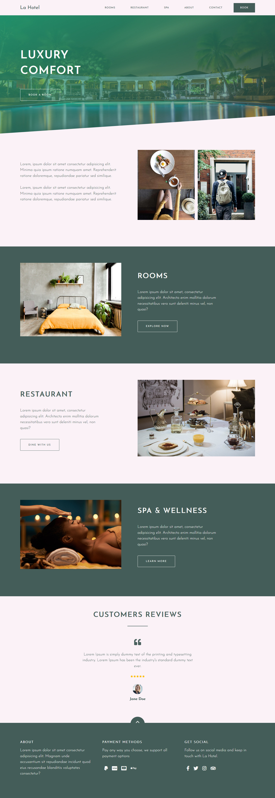

# La Hotel
 
 

La Hotel is a simple, clean and minimalistic template built for a hotel.

Built using HTML, CSS and Javascript/jQuery for the sliders.

All the images were gotten from Unsplash and Pexels.

The project contains six pages which are:

1. Homepage

2. Rooms - This conains all the available rooms, pictures, price and link for customers to see more details about the room and book.

3. Restaurant - This contains all the menus available. You can't order. You can only see what is available in the hotel menu.

4. Spa - Nothing much here. Just some pictures of the hotel spa lounge, customers and a link to book a session.

5. About - This page contains some imfo about the hotel, features and services they offer and some of their mentions by famous brands.

6. Contact - This page contains contact details of the hotel manageent which are physical address, email address, phone numbers and input fieldsto send a message.

Live Url = https://abdulsamadayoade.github.io/La-Hotel
